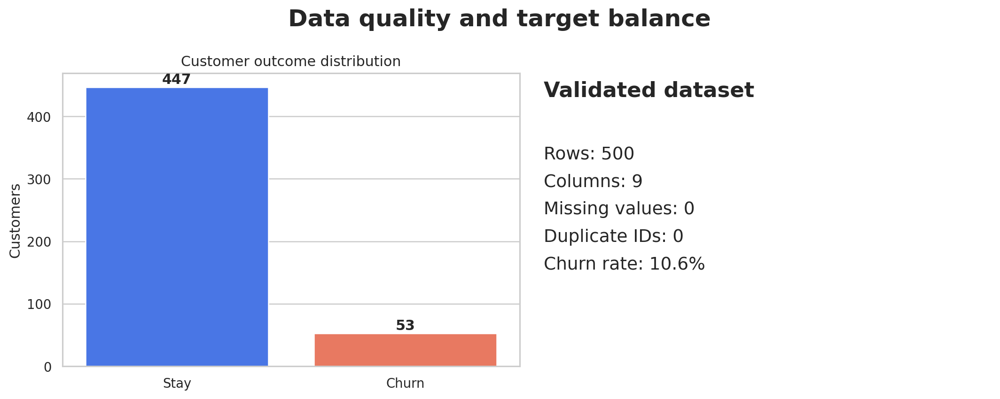
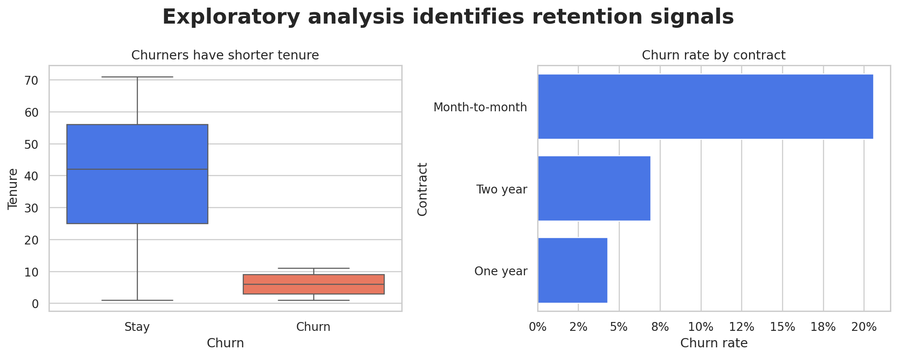
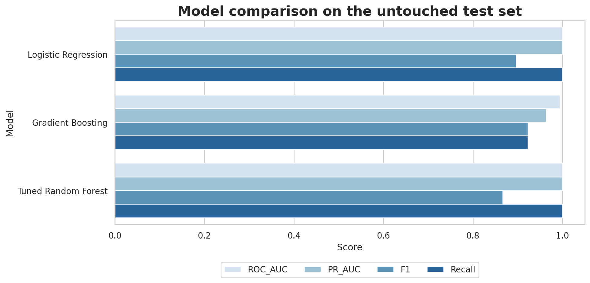
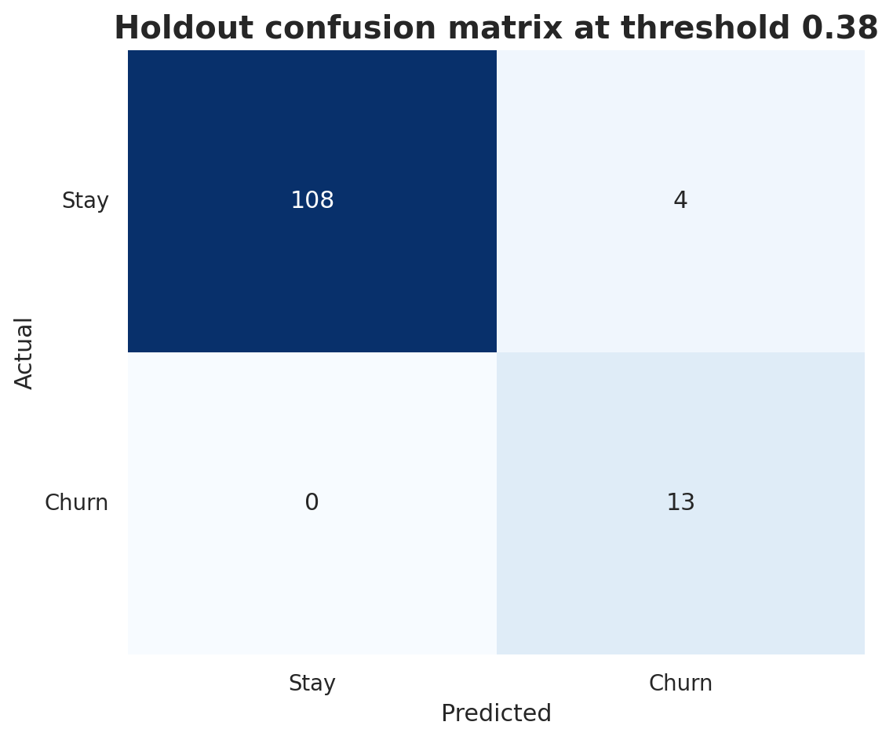
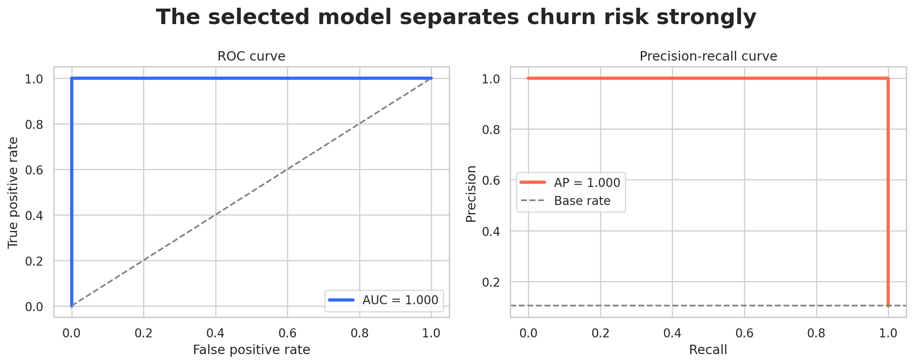
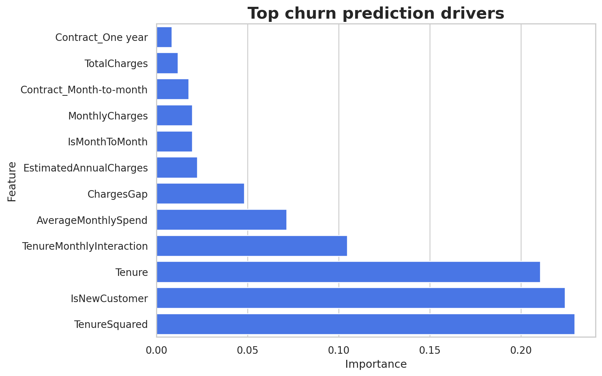
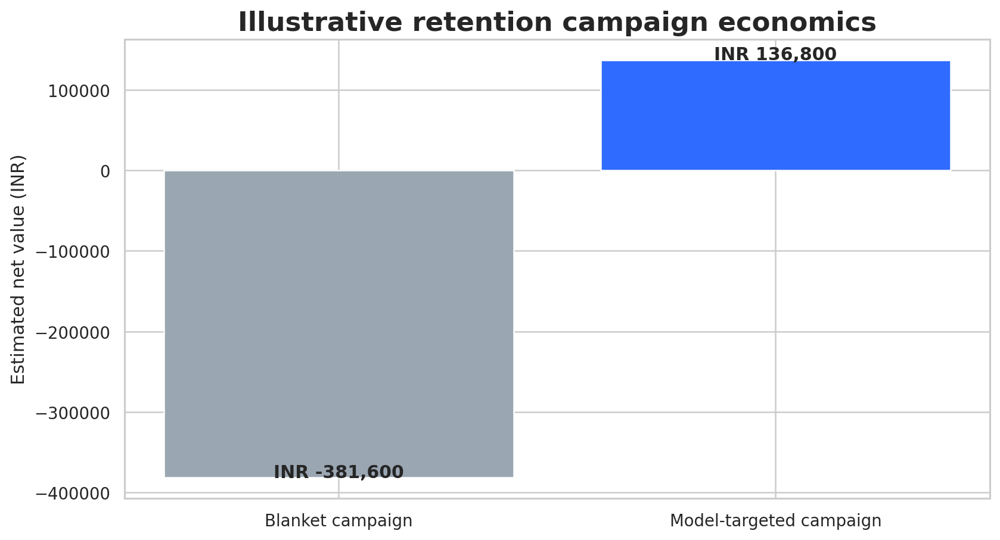
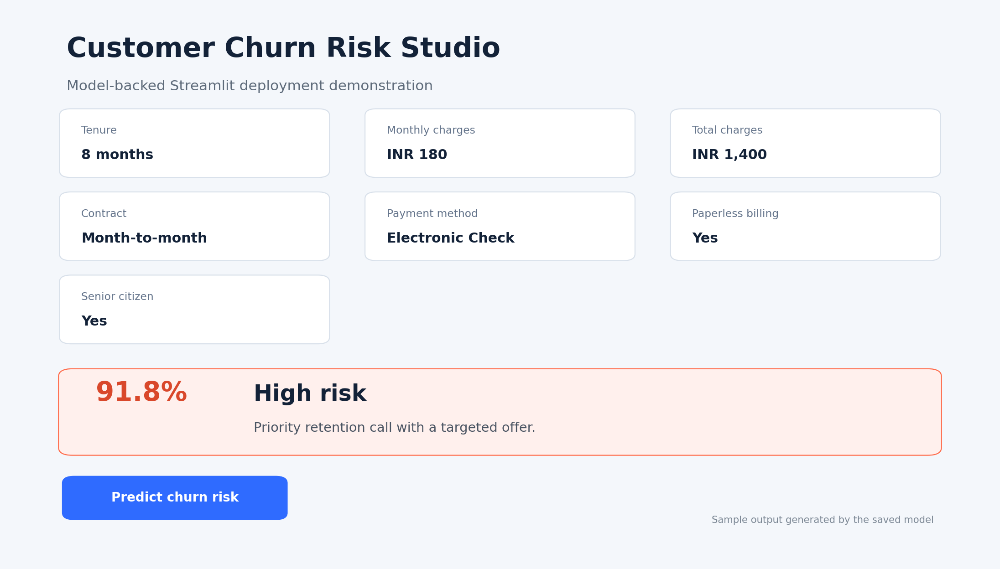

# Week 12 - Final Capstone & Career Preparation

## Customer Churn Prediction & Retention Strategy

A complete portfolio-ready data science project covering business framing, data validation, EDA, feature engineering, model comparison and tuning, interpretation, financial scenario analysis, testing, documentation, basic deployment, presentation, and career preparation.

## Results at a glance

| Metric | Holdout result |
| --- | ---: |
| Accuracy | 0.968 |
| Precision | 0.765 |
| Recall | 1.000 |
| F1 | 0.867 |
| ROC-AUC | 1.000 |
| PR-AUC | 1.000 |

The target is imbalanced (53 churners out of 500), so recall, F1, ROC-AUC, PR-AUC, and the confusion matrix are emphasized. Results come from an untouched stratified test set.

**Important limitation:** all 53 observed churn cases have tenure of 12 months or less. This unusually strong pattern explains the perfect ranking metrics and may not generalize to real production data.

## Repository structure

```text
Week_12_Final_Capstone_Career_Preparation/
|-- README.md
|-- capstone_project.ipynb
|-- customer_churn.csv
|-- requirements.txt
|-- .gitignore
|-- data/
|   |-- raw/customer_churn.csv
|   |-- processed/train.csv
|   |-- processed/test.csv
|   `-- data_dictionary.csv
|-- src/
|   |-- config.py
|   |-- data_validation.py
|   |-- features.py
|   |-- train.py
|   `-- predict.py
|-- models/
|   |-- churn_pipeline.joblib
|   `-- model_metadata.json
|-- outputs/               # metrics, predictions, tuning, importance, impact
|-- deployment/
|   |-- streamlit_app.py
|   |-- api.py
|   |-- Dockerfile
|   |-- sample_request.json
|   `-- DEPLOYMENT_GUIDE.md
|-- reports/               # technical PDF, business PDF, model card, test evidence
|-- presentation/          # 14-slide PowerPoint
|-- career/                # resume, LinkedIn, interview and networking prep
|-- screenshots/           # visual evidence
`-- tests/test_project.py
```

## Setup instructions

1. Extract the ZIP and open the folder in VS Code.
2. Create a virtual environment:

   ```bash
   python -m venv venv
   ```

3. Activate it on Windows PowerShell:

   ```powershell
   ./venv/Scripts/Activate.ps1
   ```

   Or Command Prompt:

   ```bat
   venv\Scripts\activate.bat
   ```

4. Install packages:

   ```bash
   python -m pip install -r requirements.txt
   ```

5. Open the already-executed notebook:

   ```bash
   jupyter notebook capstone_project.ipynb
   ```

## Reproduce training and tests

```bash
python -m src.train
python -m pytest tests -q
python -m src.predict --input deployment/sample_request.json
```

## Run the application

Streamlit frontend:

```bash
streamlit run deployment/streamlit_app.py
```

FastAPI service:

```bash
uvicorn deployment.api:app --reload --port 8000
```

Open `http://127.0.0.1:8000/docs` for interactive API testing.

## GitHub submission steps

```bash
git init
git add .
git commit -m "Complete Week 12 churn capstone"
git branch -M main
git remote add origin https://github.com/YOUR_USERNAME/customer-churn-capstone.git
git push -u origin main
```

Replace `YOUR_USERNAME`, add your contact links, and never commit secrets. A public Streamlit URL should be added only after successful deployment.

## Visual documentation










## Quality checklist

- [x] Clear business problem, objectives, and measurable success criteria
- [x] Validated original dataset and data dictionary
- [x] Comprehensive EDA and visual pattern identification
- [x] Leakage-safe preprocessing and 8 engineered features
- [x] Three model families and Random Forest GridSearchCV
- [x] Training-only threshold selection and untouched holdout evaluation
- [x] Accuracy, balanced accuracy, precision, recall, F1, ROC-AUC, PR-AUC, specificity
- [x] Global feature importance and limitations
- [x] Saved model, CLI, FastAPI, Streamlit, and Docker demonstration
- [x] Technical documentation and business report PDFs
- [x] 14-slide business presentation
- [x] Automated tests and recorded evidence
- [x] Resume, LinkedIn, interview, networking, and learning materials

## Sources and references

- Internship dataset supplied with the assignment.
- Scikit-learn model persistence: https://scikit-learn.org/stable/model_persistence.html
- Streamlit deployment: https://docs.streamlit.io/deploy/streamlit-community-cloud/deploy-your-app
- U.S. BLS Data Scientists outlook: https://www.bls.gov/ooh/math/data-scientists.htm
- World Economic Forum, Future of Jobs Report 2025: https://www.weforum.org/publications/the-future-of-jobs-report-2025/

